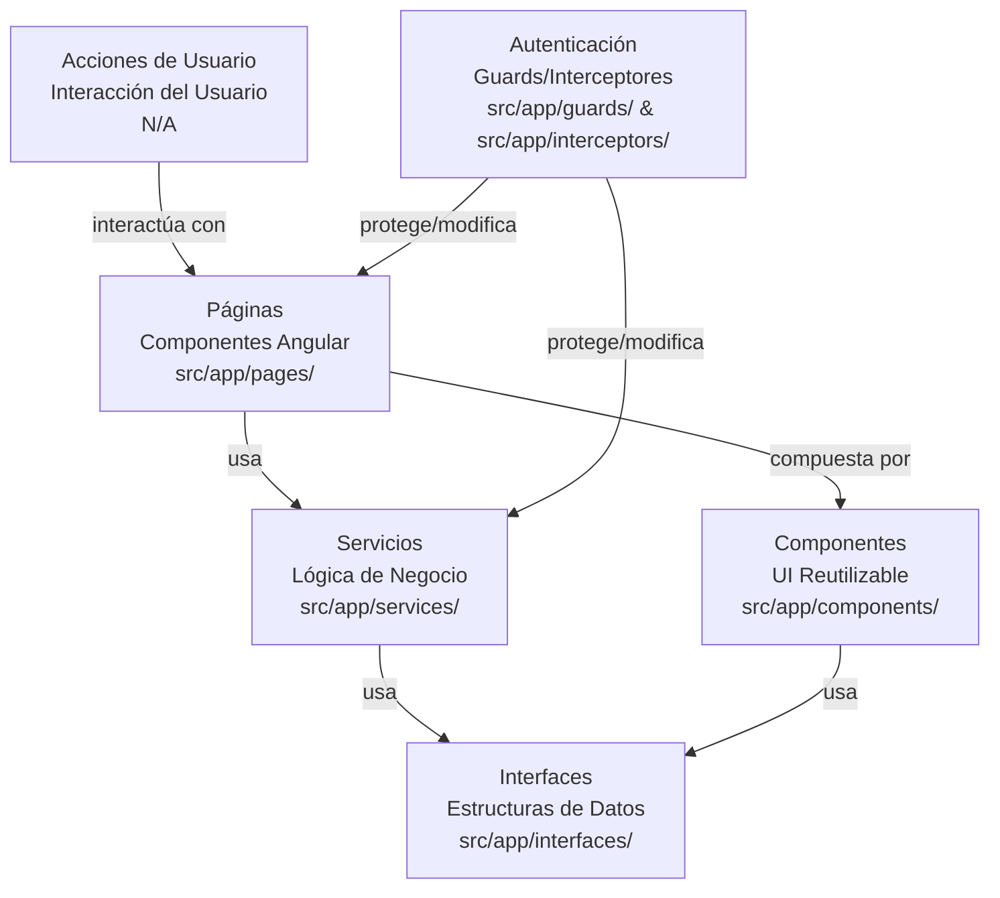
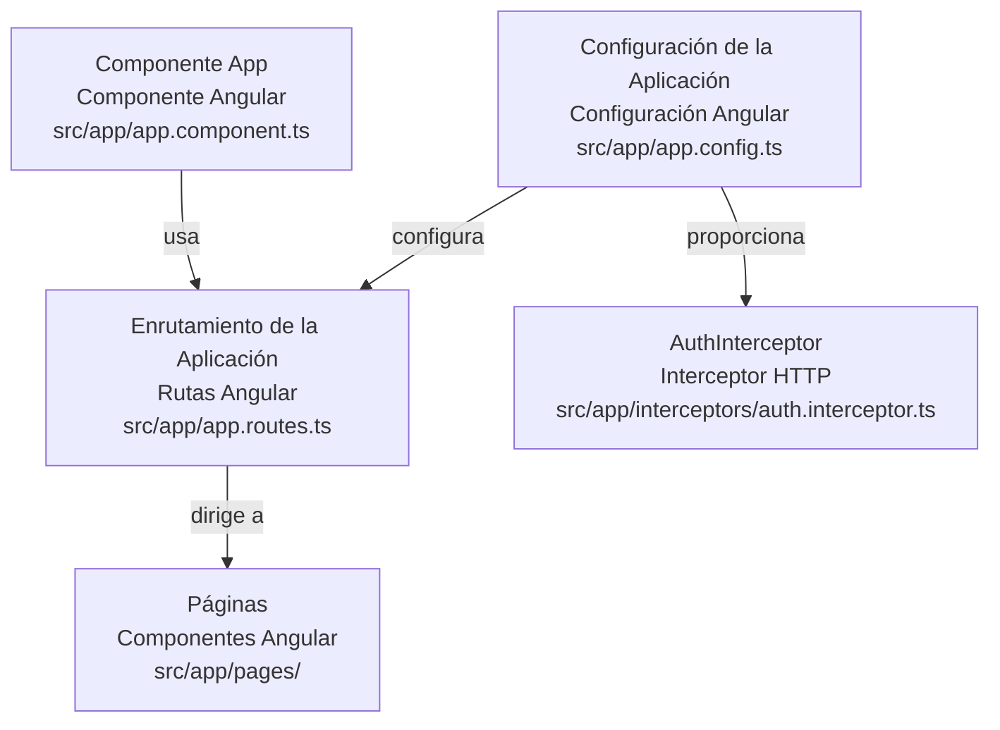
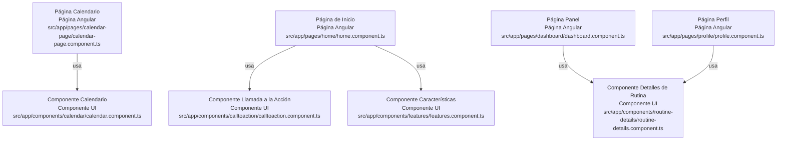
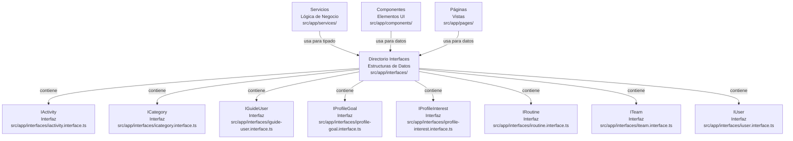
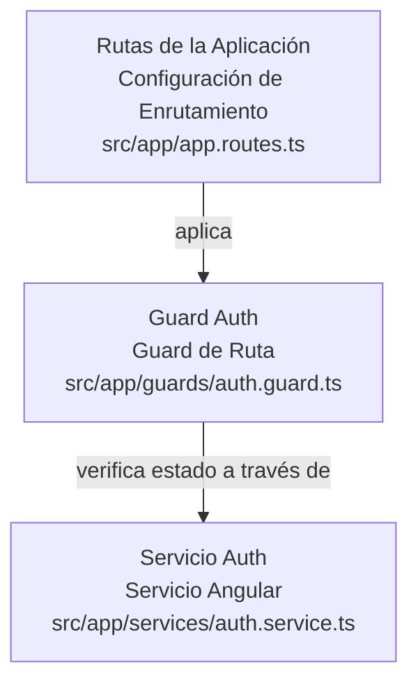
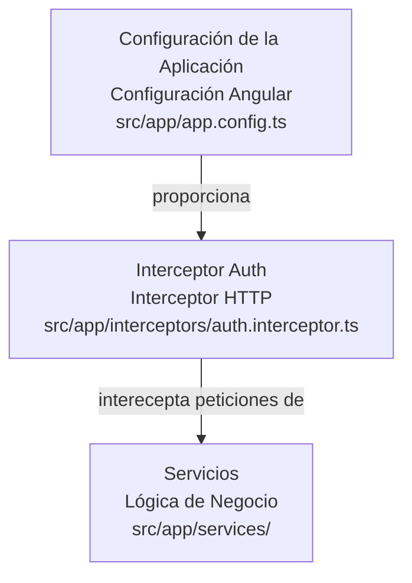
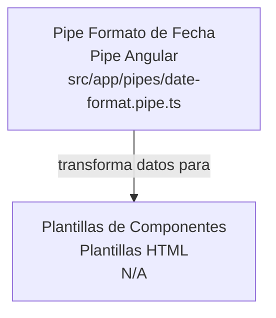
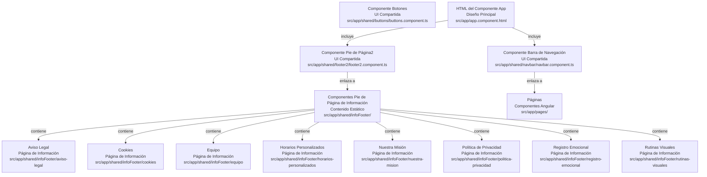

-----
# Esquema del Proyecto: tfm-TDAH

Este documento describe la **arquitectura de alto nivel** y los **componentes clave** del proyecto **tfm-TDAH**, una aplicación Angular diseñada para gestionar rutinas y actividades. El proyecto sigue una **estructura modular**, separando las responsabilidades en directorios distintos para componentes, páginas, servicios e interfaces.

-----

## Arquitectura de Alto Nivel



La aplicación está estructurada en torno a un **módulo de aplicación Angular principal**, definido en [app.config.ts](https://www.google.com/search?q=src/app/app.config.ts), que orquesta el enrutamiento, los servicios globales y el componente principal de la aplicación. La interacción del usuario fluye a través de las **páginas**, que están compuestas por **componentes** más pequeños y reutilizables. La gestión de datos y la lógica de negocio son manejadas por los **servicios**, que interactúan con las API de backend. Las estructuras de datos se definen estrictamente mediante **interfaces**. La autenticación y autorización se gestionan a través de **guards** e **interceptores**.

```
+-------------------+       +-------------------+       +-------------------+
|                   |       |                   |       |                   |
|   Acciones de     +------>|       Páginas       +------>|     Servicios     |
|     Usuario       |       | (ej., Inicio de   |       | (Obtención de     |
+-------------------+       |  Sesión, Panel)   |       |  Datos, Lógica    |
                            |                   |       |  de Negocio)     |
                            +---------^---------+       +---------^---------+
                                      |                             |
                                      | Usa                         | Proporciona
                                      |                             |
                            +---------+---------+       +---------+---------+
                            |                   |       |                   |
                            |    Componentes     |<----->|    Interfaces     |
                            | (Elementos de UI   |       | (Estructuras de   |
                            |  Reutilizables)   |       |      Datos)      |
                            +-------------------+       +-------------------+
                                      ^
                                      |
                                      | Guards/Interceptors
                                      |
                            +-------------------+
                            |                   |
                            |   Autenticación    |
                            |   (Guards,         |
                            |   Interceptores)   |
                            +-------------------+
```

-----

## Núcleo de la Aplicación



El núcleo de la aplicación se define dentro del directorio [src/app](https://www.google.com/search?q=src/app), que contiene el componente principal de la aplicación, la configuración de enrutamiento y las utilidades globales.

### **Componente App**

El **punto de entrada principal** de la aplicación Angular, responsable de iniciar la aplicación y renderizar el diseño principal.

  * **Propósito**: Sirve como el componente raíz de la aplicación, definiendo la estructura general e integrando el enrutamiento.
  * **Partes Internas**:
      * [app.component.ts](https://www.google.com/search?q=src/app/app.component.ts): La lógica del componente.
      * [app.component.html](https://www.google.com/search?q=src/app/app.component.html): La plantilla principal, que típicamente contiene un `router-outlet`.
      * [app.component.css](https://www.google.com/search?q=src/app/app.component.css): Estilos para el componente raíz.
  * **Relaciones Externas**: Utiliza el **Angular Router** definido en [app.routes.ts](https://www.google.com/search?q=src/app/app.routes.ts) para mostrar diferentes páginas.

### **Configuración de la Aplicación**

Define los **proveedores y características globales** de la aplicación.

  * **Propósito**: Configura el inyector raíz para la aplicación, incluyendo el enrutamiento, interceptores HTTP y otros servicios globales.
  * **Partes Internas**:
      * [app.config.ts](https://www.google.com/search?q=src/app/app.config.ts): Contiene el objeto `ApplicationConfig`.
  * **Relaciones Externas**: Importa `provideRouter` de `@angular/router` y `provideHttpClient` de `@angular/common/http`, junto con interceptores personalizados como [AuthInterceptor](https://www.google.com/search?q=src/app/interceptors/auth.interceptor.ts).

### **Enrutamiento de la Aplicación**

Gestiona las **rutas de navegación** y los componentes asociados dentro de la aplicación.

  * **Propósito**: Mapea las rutas URL a componentes específicos, permitiendo la navegación entre diferentes vistas.
  * **Partes Internas**:
      * [app.routes.ts](https://www.google.com/search?q=src/app/app.routes.ts): Un array de objetos `Route` que definen la navegación de la aplicación.
  * **Relaciones Externas**: Dirige a varios componentes de **páginas** basados en la URL.

-----

## Componentes de UI



El directorio [src/app/components](https://www.google.com/search?q=src/app/components) alberga **elementos de UI reutilizables** que pueden integrarse en varias páginas.

### **Componente Calendario**

Muestra una **interfaz de calendario**, probablemente para programar o ver eventos.

  * **Propósito**: Proporciona un calendario visual para la gestión de eventos.
  * **Partes Internas**:
      * [calendar.component.ts](https://www.google.com/search?q=src/app/components/calendar/calendar.component.ts)
      * [calendar.component.html](https://www.google.com/search?q=src/app/components/calendar/calendar.component.html)
      * [calendar.component.css](https://www.google.com/search?q=src/app/components/calendar/calendar.component.css)
  * **Relaciones Externas**: Utilizado dentro de la [Página Calendario](https://www.google.com/search?q=src/app/pages/calendar-page/calendar-page.component.ts).

### **Componente Llamada a la Acción**

Un componente diseñado para **solicitar la interacción del usuario**.

  * **Propósito**: Presenta una llamada a la acción, como un botón o un enlace, para fomentar la interacción del usuario.
  * **Partes Internas**:
      * [calltoaction.component.ts](https://www.google.com/search?q=src/app/components/calltoaction/calltoaction.component.ts)
      * [calltoaction.component.html](https://www.google.com/search?q=src/app/components/calltoaction/calltoaction.component.html)
      * [calltoaction.component.css](https://www.google.com/search?q=src/app/components/calltoaction/calltoaction.component.css)
  * **Relaciones Externas**: Probablemente utilizado en la [Página de Inicio](https://www.google.com/search?q=src/app/pages/home/home.component.ts) u otras páginas de aterrizaje.

### **Componente Características**

Destaca las **características clave** de la aplicación.

  * **Propósito**: Muestra las funcionalidades o beneficios principales de la aplicación.
  * **Partes Internas**:
      * [features.component.ts](https://www.google.com/search?q=src/app/components/features/features.component.ts)
      * [features.component.html](https://www.google.com/search?q=src/app/components/features/features.component.html)
      * [features.component.css](https://www.google.com/search?q=src/app/components/features/features.component.css)
  * **Relaciones Externas**: Probablemente utilizado en la [Página de Inicio](https://www.google.com/search?q=src/app/pages/home/home.component.ts).

### **Componente Detalles de Rutina**

Muestra **información detallada** sobre una rutina específica.

  * **Propósito**: Presenta los detalles de la rutina de un usuario, incluyendo actividades, metas o categorías.
  * **Partes Internas**:
      * [routine-details.component.ts](https://www.google.com/search?q=src/app/components/routine-details/routine-details.component.ts)
      * [routine-details.component.html](https://www.google.com/search?q=src/app/components/routine-details/routine-details.component.html)
      * [routine-details.component.css](https://www.google.com/search?q=src/app/components/routine-details/routine-details.component.css)
  * **Relaciones Externas**: Probablemente utilizado dentro de las páginas [Panel](https://www.google.com/search?q=src/app/pages/dashboard/dashboard.component.ts) o [Perfil](https://www.google.com/search?q=src/app/pages/profile/profile.component.ts).

-----

## Páginas

```mermaid
graph TB
  calendarPage["Página Calendario<br>Página Angular<br>src/app/pages/calendar-page/calendar-page.component.ts"]
  dashboardPage["Página Panel<br>Página Angular<br>src/app/pages/dashboard/dashboard.component.ts"]
  error404Page["Página Error 404<br>Página Angular<br>src/app/pages/error404/error404.component.ts"]
  homePage["Página de Inicio<br>Página Angular<br>src/app/pages/home/home.component.ts"]
  loginPage["Página de Inicio de Sesión<br>Página Angular<br>src/app/pages/login/login.component.ts"]
  profilePage["Página Perfil<br>Página Angular<br>src/app/pages/profile/profile.component.ts"]
  registerPage["Página de Registro<br>Página Angular<br>src/app/pages/register/register.component.ts"]
  settingsPage["Página de Configuración<br>Página Angular<br>src/app/pages/settings/settings.component.ts"]
  activityService["Servicio Actividad<br>Servicio Angular<br>src/app/services/activity.service.ts"]
  routineService["Servicio Rutina<br>Servicio Angular<br>src/app/services/routine.service.ts"]
  authService["Servicio Auth<br>Servicio Angular<br>src/app/services/auth.service.ts"]
  userService["Servicio Usuario<br>Servicio Angular<br>src/app/services/user.service.ts"]
  categoryService["Servicio Categoría<br>Servicio Angular<br>src/app/services/category.service.ts"]
  goalService["Servicio Meta<br>Servicio Angular<br>src/app/services/goal.service.ts"]
  guideUserService["Servicio Usuario Guía<br>Servicio Angular<br>src/app/services/guide-user.service.ts"]
  calendarPage --> |"interactúa con"| activityService
  calendarPage --> |"interactúa con"| routineService
  dashboardPage --> |"interactúa con"| routineService
  dashboardPage --> |"interactúa con"| activityService
  loginPage --> |"usa"| authService
  profilePage --> |"usa"| userService
  profilePage --> |"usa"| activityService
  profilePage --> |"usa"| categoryService
  profilePage --> |"usa"| goalService
  profilePage --> |"usa"| guideUserService
  profilePage --> |"usa"| routineService
  registerPage --> |"usa"| authService
  settingsPage --> |"usa"| userService
```



El directorio [src/app/pages](https://www.google.com/search?q=src/app/pages) contiene componentes que representan **vistas o pantallas completas** en la aplicación.

### **Página Calendario**

La página principal para **ver y gestionar eventos del calendario**.

  * **Propósito**: Proporciona una vista dedicada para que los usuarios interactúen con su calendario y actividades programadas.
  * **Partes Internas**:
      * [calendar-page.component.ts](https://www.google.com/search?q=src/app/pages/calendar-page/calendar-page.component.ts)
      * [calendar-page.component.html](https://www.google.com/search?q=src/app/pages/calendar-page/calendar-page.component.html)
      * [calendar-page.component.css](https://www.google.com/search?q=src/app/pages/calendar-page/calendar-page.component.css)
  * **Relaciones Externas**: Integra el **Componente Calendario** y potencialmente interactúa con el **Servicio Actividad** o el **Servicio Rutina**.

### **Página Panel**

Un **centro central** para que los usuarios vean un resumen de sus actividades y progreso.

  * **Propósito**: Presenta un resumen de los datos del usuario, rutinas y potencialmente gráficos o estadísticas.
  * **Partes Internas**:
      * [dashboard.component.ts](https://www.google.com/search?q=src/app/pages/dashboard/dashboard.component.ts)
      * [dashboard.component.html](https://www.google.com/search?q=src/app/pages/dashboard/dashboard.component.html)
      * [dashboard.component.css](https://www.google.com/search?q=src/app/pages/dashboard/dashboard.component.css)
  * **Relaciones Externas**: Interactúa con varios **servicios** (ej., **Servicio Rutina**, **Servicio Actividad**) para obtener datos.

### **Página Error 404**

Se muestra cuando una **página solicitada no se encuentra**.

  * **Propósito**: Proporciona un mensaje amigable para el usuario para URLs no válidas.
  * **Partes Internas**:
      * [error404.component.ts](https://www.google.com/search?q=src/app/pages/error404/error404.component.ts)
      * [error404.component.html](https://www.google.com/search?q=src/app/pages/error404/error404.component.html)
      * [error404.component.css](https://www.google.com/search?q=src/app/pages/error404/error404.component.css)

### **Página de Inicio**

La **página de aterrizaje** de la aplicación.

  * **Propósito**: Presenta la aplicación y guía a los usuarios a características o acciones clave.
  * **Partes Internas**:
      * [home.component.ts](https://www.google.com/search?q=src/app/pages/home/home.component.ts)
      * [home.component.html](https://www.google.com/search?q=src/app/pages/home/home.component.html)
      * [home.component.css](https://www.google.com/search?q=src/app/pages/home/home.component.css)
  * **Relaciones Externas**: Probablemente incorpora el **Componente Llamada a la Acción** y el **Componente Características**.

### **Página de Inicio de Sesión**

Maneja la **autenticación de usuarios**.

  * **Propósito**: Permite a los usuarios existentes iniciar sesión en sus cuentas.
  * **Partes Internas**:
      * [login.component.ts](https://www.google.com/search?q=src/app/pages/login/login.component.ts)
      * [login.component.html](https://www.google.com/search?q=src/app/pages/login/login.component.html)
      * [login.component.css](https://www.google.com/search?q=src/app/pages/login/login.component.css)
  * **Relaciones Externas**: Interactúa con el **Servicio Auth** para la autenticación.

### **Página Perfil**

Muestra y permite la **edición de la información del perfil del usuario**, rutinas y preferencias.

  * **Propósito**: Proporciona un espacio personalizado para que los usuarios administren los detalles de su cuenta y los datos relacionados.
  * **Partes Internas**:
      * [profile.component.ts](https://www.google.com/search?q=src/app/pages/profile/profile.component.ts)
      * [profile.component.html](https://www.google.com/search?q=src/app/pages/profile/profile.component.html)
      * [profile.component.css](https://www.google.com/search?q=src/app/pages/profile/profile.component.css)
      * **Sub-modales**: Contiene varios componentes modales para agregar/editar actividades, categorías, metas, usuarios guía, intereses y rutinas (ej., [add-activity-modal](https://www.google.com/search?q=src/app/pages/profile/add-activity-modal/add-activity-modal.component.ts), [add-category-modal](https://www.google.com/search?q=src/app/pages/profile/add-category-modal/add-category-modal.component.ts)).
  * **Relaciones Externas**: Interactúa con el **Servicio Usuario**, **Servicio Actividad**, **Servicio Categoría**, **Servicio Meta**, **Servicio Usuario Guía**, **Servicio Rutina** para la gestión de datos.

### **Página de Registro**

Permite a los **nuevos usuarios crear una cuenta**.

  * **Propósito**: Facilita la creación de nuevas cuentas de usuario.
  * **Partes Internas**:
      * [register.component.ts](https://www.google.com/search?q=src/app/pages/register/register.component.ts)
      * [register.component.html](https://www.google.com/search?q=src/app/pages/register/register.component.html)
      * [register.component.css](https://www.google.com/search?q=src/app/pages/register/register.component.css)
  * **Relaciones Externas**: Interactúa con el **Servicio Auth** para el registro de usuarios.

### **Página de Configuración**

Proporciona **opciones para configurar los ajustes** de la aplicación.

  * **Propósito**: Permite a los usuarios personalizar el comportamiento y las preferencias de la aplicación.
  * **Partes Internas**:
      * [settings.component.ts](https://www.google.com/search?q=src/app/pages/settings/settings.component.ts)
      * [settings.component.html](https://www.google.com/search?q=src/app/pages/settings/settings.component.html)
      * [settings.component.css](https://www.google.com/search?q=src/app/pages/settings/settings.component.css)
      * **Subsecciones**: `appearance/` y `profile-settings/` para categorías de configuración específicas.
  * **Relaciones Externas**: Puede interactuar con el **Servicio Usuario** para actualizar las preferencias del usuario.

-----

## Servicios

```mermaid
graph TB
  activityService["Servicio Actividad<br>Servicio Angular<br>src/app/services/activity.service.ts"]
  authService["Servicio Auth<br>Servicio Angular<br>src/app/services/auth.service.ts"]
  categoryService["Servicio Categoría<br>Servicio Angular<br>src/app/services/category.service.ts"]
  goalService["Servicio Meta<br>Servicio Angular<br>src/app/services/goal.service.ts"]
  guideUserService["Servicio Usuario Guía<br>Servicio Angular<br>src/app/services/guide-user.service.ts"]
  routineService["Servicio Rutina<br>Servicio Angular<br>src/app/services/routine.service.ts"]
  teamService["Servicio Equipo<br>Servicio Angular<br>src/app/services/team.service.ts"]
  userService["Servicio Usuario<br>Servicio Angular<br>src/app/services/user.service.ts"]
  profilePage["Página Perfil<br>Página Angular<br>src/app/pages/profile/profile.component.ts"]
  calendarPage["Página Calendario<br>Página Angular<br>src/app/pages/calendar-page/calendar-page.component.ts"]
  loginPage["Página de Inicio de Sesión<br>Página Angular<br>src/app/pages/login/login.component.ts"]
  registerPage["Página de Registro<br>Página Angular<br>src/app/pages/register/register.component.ts"]
  authGuard["Guard Auth<br>Guard de Ruta Angular<br>src/app/guards/auth.guard.ts"]
  dashboardPage["Página Panel<br>Página Angular<br>src/app/pages/dashboard/dashboard.component.ts"]
  settingsPage["Página de Configuración<br>Página Angular<br>src/app/pages/settings/settings.component.ts"]
  routineDetailsComp["Componente Detalles de Rutina<br>Componente UI<br>src/app/components/routine-details/routine-details.component.ts"]
  profilePage --> |"consume"| activityService
  calendarPage --> |"consume"| activityService
  loginPage --> |"consume"| authService
  registerPage --> |"consume"| authService
  authGuard --> |"consume"| authService
  profilePage --> |"consume"| categoryService
  profilePage --> |"consume"| goalService
  profilePage --> |"consume"| guideUserService
  profilePage --> |"consume"| routineService
  dashboardPage --> |"consume"| routineService
  routineDetailsComp --> |"consume"| routineService
  profilePage --> |"consume"| userService
  settingsPage --> |"consume"| userService
```



El directorio [src/app/services](https://www.google.com/search?q=src/app/services) contiene **clases inyectables** que proporcionan datos y lógica de negocio a los componentes.

### **Servicio Actividad**

Gestiona las **operaciones relacionadas con las actividades del usuario**.

  * **Propósito**: Proporciona métodos para crear, leer, actualizar y eliminar actividades del usuario.
  * **Partes Internas**:
      * [activity.service.ts](https://www.google.com/search?q=src/app/services/activity.service.ts)
  * **Relaciones Externas**: Interactúa con las API de backend y es consumido por páginas como la **Página Perfil** y la **Página Calendario**.

### **Servicio Auth**

Maneja la **autenticación y autorización** de usuarios.

  * **Propósito**: Gestiona el inicio de sesión, registro y gestión de sesiones de usuario.
  * **Partes Internas**:
      * [auth.service.ts](https://www.google.com/search?q=src/app/services/auth.service.ts)
  * **Relaciones Externas**: Consumido por la **Página de Inicio de Sesión**, la **Página de Registro** y el **Guard Auth**.

### **Servicio Categoría**

Gestiona las **operaciones relacionadas con las categorías de actividad**.

  * **Propósito**: Proporciona métodos para gestionar las categorías asociadas a las actividades.
  * **Partes Internas**:
      * [category.service.ts](https://www.google.com/search?q=src/app/services/category.service.ts)
  * **Relaciones Externas**: Consumido por la **Página Perfil** y potencialmente otros componentes relacionados con actividades.

### **Servicio Meta**

Gestiona las **operaciones relacionadas con las metas del usuario**.

  * **Propósito**: Proporciona métodos para gestionar las metas definidas por el usuario.
  * **Partes Internas**:
      * [goal.service.ts](https://www.google.com/search?q=src/app/services/goal.service.ts)
  * **Relaciones Externas**: Consumido por la **Página Perfil**.

### **Servicio Usuario Guía**

Gestiona las **operaciones relacionadas con los usuarios guía**.

  * **Propósito**: Proporciona métodos para gestionar la información de los usuarios guía.
  * **Partes Internas**:
      * [guide-user.service.ts](https://www.google.com/search?q=src/app/services/guide-user.service.ts)
  * **Relaciones Externas**: Consumido por la **Página Perfil**.

### **Servicio Rutina**

Gestiona las **operaciones relacionadas con las rutinas del usuario**.

  * **Propósito**: Proporciona métodos para crear, leer, actualizar y eliminar rutinas del usuario.
  * **Partes Internas**:
      * [routine.service.ts](https://www.google.com/search?q=src/app/services/routine.service.ts)
  * **Relaciones Externas**: Consumido por la **Página Perfil**, la **Página Panel** y el **Componente Detalles de Rutina**.

### **Servicio Equipo**

Gestiona las **operaciones relacionadas con la información del equipo**.

  * **Propósito**: Proporciona métodos para gestionar datos relacionados con el equipo.
  * **Partes Internas**:
      * [team.service.ts](https://www.google.com/search?q=src/app/services/team.service.ts)
  * **Relaciones Externas**: Potencialmente consumido por una sección "Acerca de nosotros" o "Equipo" dentro de la aplicación.

### **Servicio Usuario**

Gestiona las **operaciones relacionadas con los perfiles y datos del usuario**.

  * **Propósito**: Proporciona métodos para obtener y actualizar la información del perfil del usuario.
  * **Partes Internas**:
      * [user.service.ts](https://www.google.com/search?q=src/app/services/user.service.ts)
  * **Relaciones Externas**: Consumido por la **Página Perfil** y la **Página de Configuración**.

-----

## Interfaces



El directorio [src/app/interfaces](https://www.google.com/search?q=src/app/interfaces) define las **estructuras de datos** utilizadas en toda la aplicación, asegurando la seguridad de tipos y la consistencia.

  * **Propósito**: Define los contratos para los objetos de datos intercambiados entre el frontend y el backend, y dentro de la aplicación.
  * **Partes Internas**:
      * [iactivity.interface.ts](https://www.google.com/search?q=src/app/interfaces/iactivity.interface.ts): Define la estructura de una actividad.
      * [icategory.interface.ts](https://www.google.com/search?q=src/app/interfaces/icategory.interface.ts): Define la estructura de una categoría.
      * [iguide-user.interface.ts](https://www.google.com/search?q=src/app/interfaces/iguide-user.interface.ts): Define la estructura de un usuario guía.
      * [iprofile-goal.interface.ts](https://www.google.com/search?q=src/app/interfaces/iprofile-goal.interface.ts): Define la estructura de una meta de perfil.
      * [iprofile-interest.interface.ts](https://www.google.com/search?q=src/app/interfaces/iprofile-interest.interface.ts): Define la estructura de un interés de perfil.
      * [iroutine.interface.ts](https://www.google.com/search?q=src/app/interfaces/iroutine.interface.ts): Define la estructura de una rutina.
      * [iteam.interface.ts](https://www.google.com/search?q=src/app/interfaces/iteam.interface.ts): Define la estructura de un miembro del equipo.
      * [iuser.interface.ts](https://www.google.com/search?q=src/app/interfaces/iuser.interface.ts): Define la estructura de un usuario.
  * **Relaciones Externas**: Utilizadas por los **servicios** para el tipado de datos y por los **componentes** y **páginas** para mostrar y manipular datos.

-----

## Guards



El directorio [src/app/guards](https://www.google.com/search?q=src/app/guards) contiene **guards de ruta** que controlan el acceso a diferentes partes de la aplicación.

### **Guard Auth**

Protege las rutas que **requieren autenticación de usuario**.

  * **Propósito**: Impide que los usuarios no autenticados accedan a rutas protegidas.
  * **Partes Internas**:
      * [auth.guard.ts](https://www.google.com/search?q=src/app/guards/auth.guard.ts)
  * **Relaciones Externas**: Utiliza el **Servicio Auth** para verificar el estado de autenticación y se aplica a las rutas en [app.routes.ts](https://www.google.com/search?q=src/app/app.routes.ts).

-----

## Interceptores



El directorio [src/app/interceptors](https://www.google.com/search?q=src/app/interceptors) contiene **interceptores HTTP** que pueden modificar las solicitudes salientes o las respuestas entrantes.

### **Interceptor Auth**

Agrega **tokens de autenticación** a las solicitudes HTTP salientes.

  * **Propósito**: Adjunta automáticamente tokens de autenticación (ej., JWT) a las solicitudes HTTP, simplificando las llamadas a la API.
  * **Partes Internas**:
      * [auth.interceptor.ts](https://www.google.com/search?q=src/app/interceptors/auth.interceptor.ts)
  * **Relaciones Externas**: Intercepta las solicitudes HTTP realizadas por los **servicios** y se proporciona globalmente en [app.config.ts](https://www.google.com/search?q=src/app/app.config.ts).

-----

## Pipes



El directorio [src/app/pipes](https://www.google.com/search?q=src/app/pipes) contiene **pipes personalizados** para la transformación de datos en plantillas.

### **Pipe Formato de Fecha**

Formatea **fechas para su visualización**.

  * **Propósito**: Transforma objetos de fecha en un formato de cadena fácil de usar.
  * **Partes Internas**:
      * [date-format.pipe.ts](https://www.google.com/search?q=src/app/pipes/date-format.pipe.ts)
  * **Relaciones Externas**: Utilizado dentro de varias plantillas de componentes para mostrar fechas.

-----

## Componentes Compartidos



El directorio [src/app/shared](https://www.google.com/search?q=src/app/shared) contiene **componentes y utilidades** que se utilizan en múltiples partes de la aplicación.

### **Componente Botones**

**Componentes de botón reutilizables**.

  * **Propósito**: Proporciona un estilo y comportamiento consistentes para los botones en toda la aplicación.
  * **Partes Internas**:
      * [buttons.component.ts](https://www.google.com/search?q=src/app/shared/buttons/buttons.component.ts)
      * [buttons.component.html](https://www.google.com/search?q=src/app/shared/buttons/buttons.component.html)
      * [buttons.component.css](https://www.google.com/search?q=src/app/shared/buttons/buttons.component.css)

### **Componente Pie de Página2**

Un **pie de página común** para la aplicación.

  * **Propósito**: Muestra información de derechos de autor, enlaces u otro contenido común del pie de página.
  * **Partes Internas**:
      * [footer2.component.ts](https://www.google.com/search?q=src/app/shared/footer2/footer2.component.ts)
      * [footer2.component.html](https://www.google.com/search?q=src/app/shared/footer2/footer2.component.html)
      * [footer2.component.css](https://www.google.com/search?q=src/app/shared/footer2/footer2.component.css)

### **Componentes de Pie de Página de Información**

Contiene varias **páginas informativas** vinculadas desde el pie de página.

  * **Propósito**: Proporciona páginas de contenido estático como avisos legales, políticas de cookies y declaraciones de misión.
  * **Partes Internas**:
      * [aviso-legal/](https://www.google.com/search?q=src/app/shared/infoFooter/aviso-legal)
      * [cookies/](https://www.google.com/search?q=src/app/shared/infoFooter/cookies)
      * [equipo/](https://www.google.com/search?q=src/app/shared/infoFooter/equipo)
      * [horarios-personalizados/](https://www.google.com/search?q=src/app/shared/infoFooter/horarios-personalizados)
      * [nuestra-mision/](https://www.google.com/search?q=src/app/shared/infoFooter/nuestra-mision)
      * [politica-privacidad/](https://www.google.com/search?q=src/app/shared/infoFooter/politica-privacidad)
      * [registro-emocional/](https://www.google.com/search?q=src/app/shared/infoFooter/registro-emocional)
      * [rutinas-visuales/](https://www.google.com/search?q=src/app/shared/infoFooter/rutinas-visuales)

### **Componente Barra de Navegación**

La **barra de navegación principal** de la aplicación.

  * **Propósito**: Proporciona enlaces de navegación a diferentes secciones de la aplicación.
  * **Partes Internas**:
      * [navbar.component.ts](https://www.google.com/search?q=src/app/shared/navbar/navbar.component.ts)
      * [navbar.component.html](https://www.google.com/search?q=src/app/shared/navbar/navbar.component.html)
      * [navbar.component.css](https://www.google.com/search?q=src/app/shared/navbar/navbar.component.css)
  * **Relaciones Externas**: Utilizado en el [app.component.html](https://www.google.com/search?q=src/app/app.component.html) principal y enlaza a varias **páginas** a través del enrutamiento.

-----

*Generado por [CodeViz.ai](https://codeviz.ai) el 5/7/2025, 10:18:10*